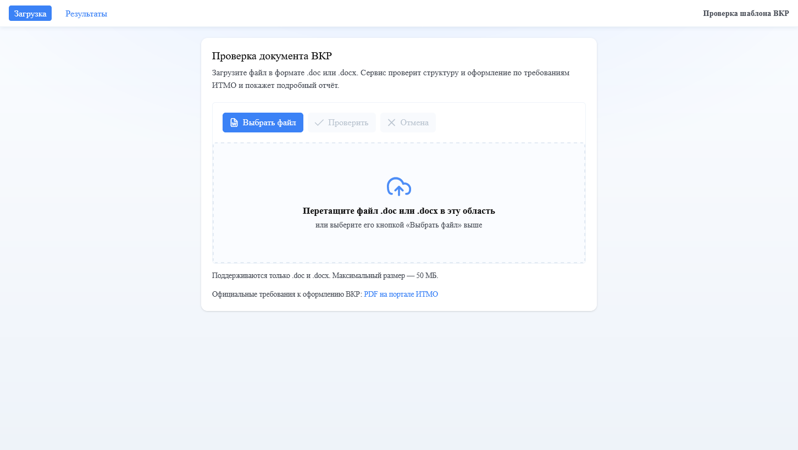
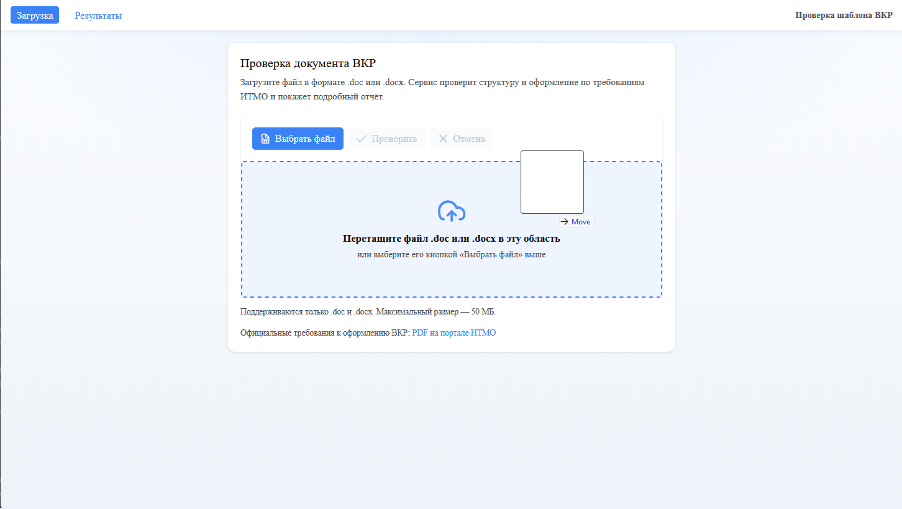
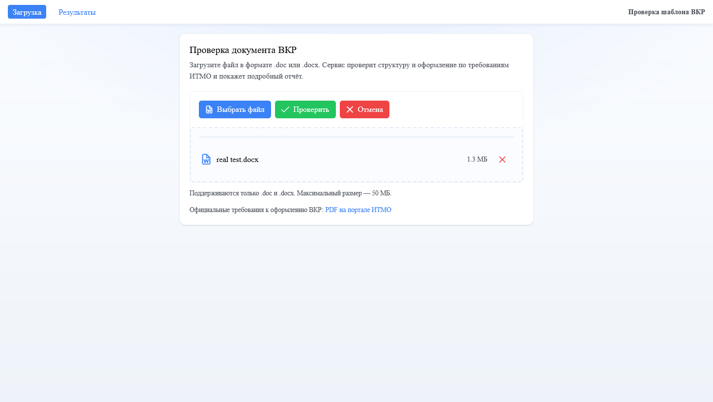
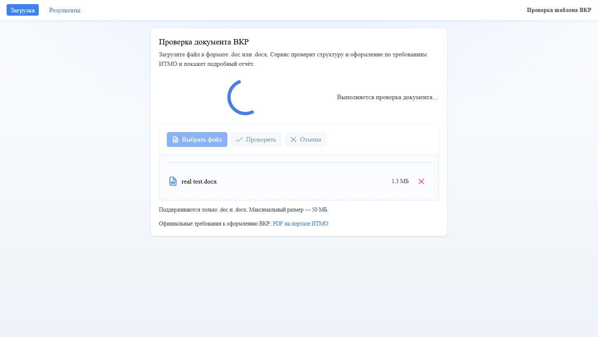
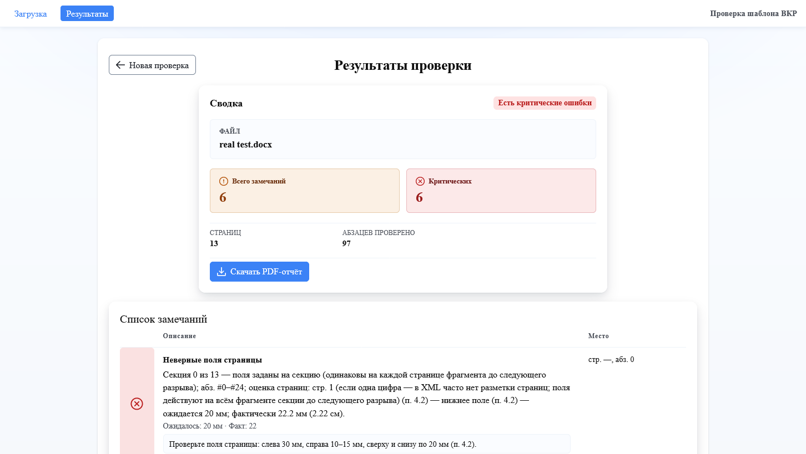
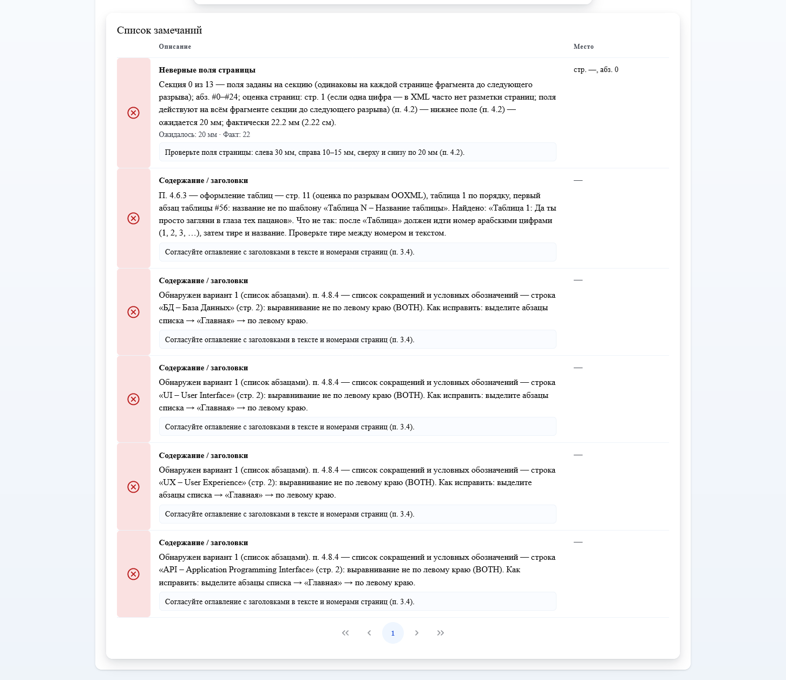
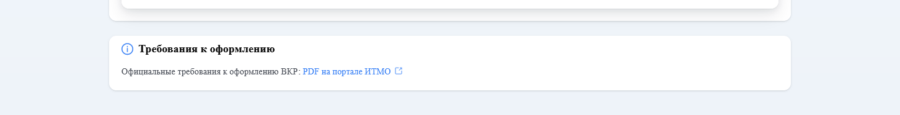
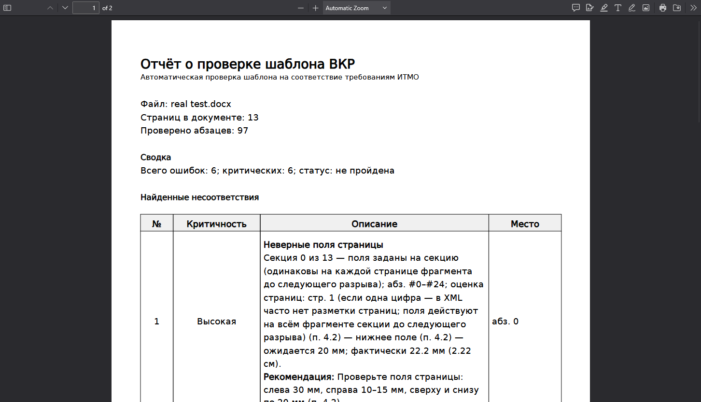
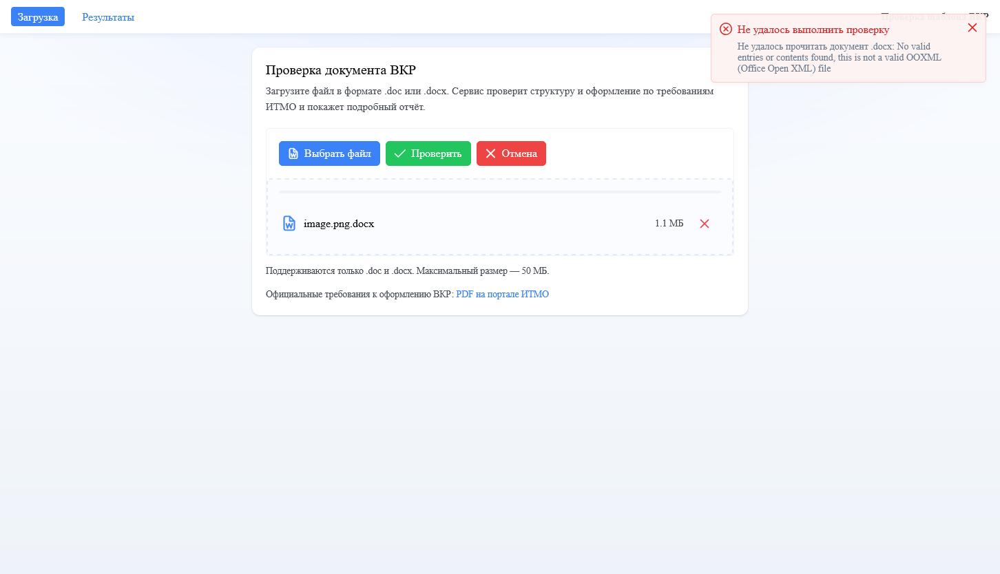

# Руководство пользователя

Сервис проверяет документ выпускной квалификационной работы (ВКР) в формате Word (`.doc` или `.docx`) на соответствие требованиям к оформлению. Ниже — как загрузить файл, посмотреть результаты и скачать отчёт, а также что делать при типичных ошибках.

## Главная страница

После открытия приложения отображается карточка **«Проверка документа ВКР»** с кратким пояснением и зоной загрузки файла.

Внизу указано: поддерживаются только **.doc** и **.docx**, максимальный размер файла — **50 МБ**. Есть ссылка на официальный PDF с требованиями ИТМО (**«PDF на портале ИТМО»**).

---

## Загрузка файла

Есть два способа:

1. **Перетаскивание (drag and drop)** — перетащите файл в пунктирную область.
2. **Выбор с диска** — нажмите **«Выбрать файл»**, в диалоге выберите документ.

После выбора файла отображаются его имя и размер; доступны кнопки **«Проверить»** (отправить на проверку), **«Отмена»** (сбросить выбор) и значок удаления файла из очереди.

Нажмите **«Проверить»**. Пока идёт обращение к серверу и ожидание результата, показывается индикатор с текстом **«Выполняется проверка документа…»**.

При успешном завершении проверки откроется страница результатов; всплывающее уведомление сообщит **«Проверка завершена»** и что открывается страница с результатами.

---

## Страница результатов

Заголовок страницы — **«Результаты проверки»**. Сверху слева кнопка **«Новая проверка»** возвращает на главную и очищает сохранённый результат текущей сессии.

### Сводка

В блоке **«Сводка»** отображаются:

- имя файла;
- тег статуса: **«Без критических ошибок»**, **«Есть замечания»** или **«Есть критические ошибки»** (в зависимости от итога проверки);
- плитки **«Всего замечаний»** и **«Критических»**;
- при наличии данных — число страниц и проверенных абзацев.

Кнопка **«Скачать PDF-отчёт»** формирует и сохраняет на устройство PDF с тем же содержанием, что и сводка со списком замечаний на сайте.

### Список замечаний

Блок **«Список замечаний»** — таблица с колонками важности (иконка), описания (тип ошибки по-русски, текст, при необходимости «Ожидалось» / «Факт», рекомендация) и **«Место»** (страница, абзац, при необходимости элемент документа). Таблица с пагинацией (10 строк на страницу).

Если замечаний нет, в таблице отображается строка **«Замечаний не найдено.»**

### Требования ИТМО

Внизу страницы результатов — карточка **«Требования к оформлению»** со ссылкой **«PDF на портале ИТМО»** на официальный документ университета.

Та же ссылка доступна на главной странице под зоной загрузки.

---

## PDF-отчёт

После нажатия **«Скачать PDF-отчёт»** браузер сохраняет файл (по умолчанию может называться `vkr-report.pdf`; фактическое имя зависит от настроек браузера и сервера). В отчёте — сводка и перечень замечаний в удобном для печати виде.

---

## Ошибки и что делать

### Неверный тип файла

Если выбран не Word-документ (например, PDF или изображение), интерфейс покажет сообщение о неверном формате (**нужны .doc или .docx**). Выберите подходящий файл и повторите проверку.

### Повреждённый или нечитаемый файл

Если файл с расширением `.docx` повреждён или не является нормальным документом Word, проверка может завершиться ошибкой. На главной появится уведомление **«Не удалось выполнить проверку»** с пояснением.

**Что сделать:** откройте документ в Word, сохраните копию как новый `.docx`, проверьте, что файл открывается без ошибок; при необходимости восстановите документ средствами Word и загрузите снова.

### Слишком большой файл

Лимит — **50 МБ**. Уменьшите объём вложений или разбейте работу на этапы (если допустимо по правилам сдачи) и загрузите файл меньшего размера.

### Сервер перегружен

При очереди на обработку сервер может ответить, что сейчас нельзя принять задание. **Подождите** и попробуйте загрузить файл через некоторое время.

### Результат проверки больше недоступен

Если долго не заходить на страницу результатов, идентификатор задания на сервере может устареть. **Загрузите файл заново** с главной страницы.

### Ошибка при скачивании PDF

Если PDF не сформировался, появится уведомление об ошибке. Обновите страницу результатов и нажмите **«Скачать PDF-отчёт»** ещё раз; при повторении ошибки выполните новую проверку документа.

### Нет результатов на странице «Результаты»

Если открыть `/results` без предварительной проверки в этой же вкладке браузера, отображается подсказка и кнопка **«Перейти к загрузке»**. Сначала проведите проверку на главной странице.

---

## Краткая схема

1. Главная → выбор `.doc` / `.docx` → **«Проверить»** → ожидание.
2. Автоматический переход на **«Результаты проверки»** → просмотр сводки и таблицы замечаний.
3. При необходимости — **«Скачать PDF-отчёт»**.
4. Для новой работы — **«Новая проверка»** на странице результатов.
